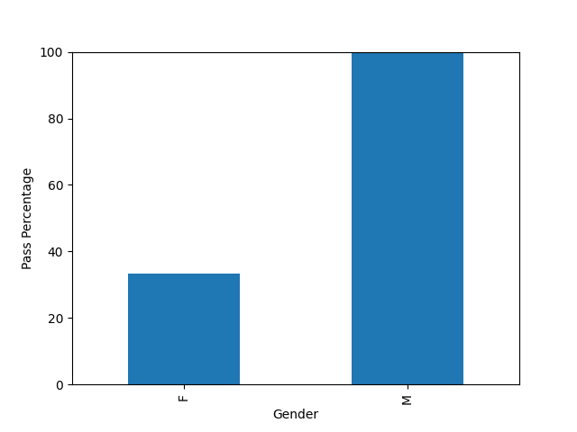
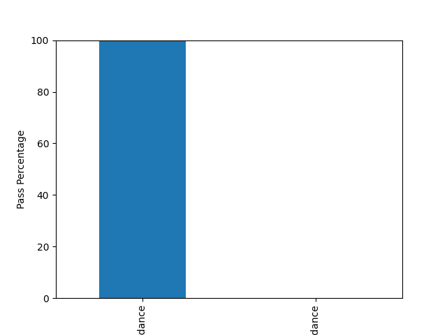

# AI Ethics Validator

## 🔍 Project Overview
AI Ethics Validator is a Python-based system designed to evaluate fairness and ethical risks in AI-driven decision systems.
Instead of building a prediction model, this project focuses on auditing existing AI decisions to identify bias and unfair treatment.

The system analyzes decision outcomes across multiple attributes and provides quantitative ethics scores, explainable insights, and visual evidence.

---

## 🎯 Key Features
- Bias detection across **Gender, Attendance, and Marks**
- Ethics Score calculation (0–100) to assess ethical risk
- Classification of AI decisions as Ethical, Moderate Risk, or Unethical
- Explainable AI outputs with human-readable explanations
- Rule-based pass logic using **Marks ≥ 35** (without modifying original data)
- Interactive **Streamlit dashboard**
- Toggle to compare original AI decisions and rule-based decisions
- Automatic generation of visual proof (charts saved as images)

---

## 🛠️ Technologies Used
- Python
- Pandas
- Matplotlib
- Streamlit

---

## 📊 Output & Visual Evidence

### Gender Bias Analysis


### Attendance Bias Analysis


### Marks Bias Analysis


---

## ▶️ How to Run the Project

Make sure **Python 3.9 or above** is installed.

```bash
pip install pandas matplotlib streamlit
python ethics_check.py
streamlit run dashboard.py
